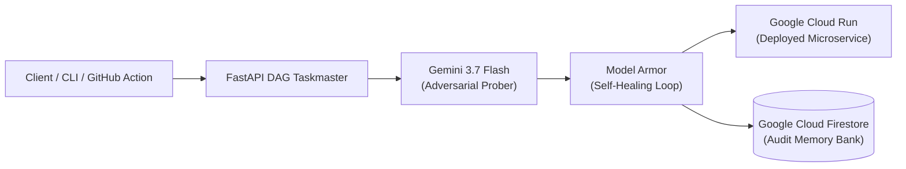

# 🚀 Bashar Ibrahem — Autonomous AI & Agentic Systems Portfolio

<div align="center">

[](https://bashar-my-portfolio.vercel.app)
[](https://github.com/Bashar-ml-en/Auto_Guard_AI_Agent)
[](https://vitejs.dev/)
[](https://www.typescriptlang.org/)
[](https://github.com/Bashar-ml-en/Auto_Guard_AI_Agent)

<p align="center">
  <strong>Production-grade engineering portfolio showcasing autonomous multi-agent taskmasters, LLM red-teaming SecOps toolchains, and verified predictive machine learning systems.</strong>
</p>

[🌐 **Live Portfolio**](https://bashar-my-portfolio.vercel.app) • [🛡️ **AutoGuard AI Flagship**](https://autoguard-ai-agent.vercel.app) • [📦 **GitHub Profile**](https://github.com/Bashar-ml-en) • [📑 **Download Resume**](https://bashar-my-portfolio.vercel.app/Bashar_Ibrahem_MLEngineer.pdf)

</div>

---

## 📌 Executive Positioning

I am an **Autonomous AI & Machine Learning Engineer** specializing in frontier LLM agent orchestration, automated red-teaming security toolchains, evolutionary prompt hardening, and production-grade full-stack ML architectures.

This portfolio is engineered with a **Recruiter-First hierarchy**: technical decision-makers immediately encounter verifiable code, live interactive deployments, and architectural DAGs without wading through generic text.

```
┌─────────────────────────────────────────────────────────────────────────────┐
│                       RECRUITER-FIRST NAVIGATION FLOW                       │
│                                                                             │
│  Hero  ──>  Proof Stats  ──>  [⭐ PROJECTS (#2)]  ──>  Stack  ──>  Contact  │
└─────────────────────────────────────────────────────────────────────────────┘
```

---

## 📊 Verifiable Proof Metrics

| Metric | Measurement | Verification Standard |
| :--- | :--- | :--- |
| **AI Safety Resilience** | **98.6%** | AutoGuard AI Model Armor Benchmark |
| **Automated Test Coverage** | **14 / 14 (100%)** | Automated `pytest tests/ -v` CI Gate |
| **Production AI & ML Systems** | **9+ Shipped** | Live Vercel & Container Microservices |
| **Autonomous Self-Healing** | **<30 Seconds** | 6-Stage Parallel DAG Execution Speed |

---

## 🌟 Featured Production Flagships

### 1. 🛡️ AutoGuard AI — Autonomous AI Red-Teaming & Prompt Hardening Agent
> **Event**: Built for the *Google All Things Agentic Global Hackathon* (The Taskmaster Track)  
> **Links**: [⚡ Live Web Console](https://autoguard-ai-agent.vercel.app) • [📦 GitHub Repository](https://github.com/Bashar-ml-en/Auto_Guard_AI_Agent)

* **Autonomous 6-Stage DAG Execution Graph**: Orchestrates multi-agent state machines with **Google Gemini 3.7 Flash** and **Gemini 2.5 Flash** using the `google-genai` SDK.
* **Adversarial Synthesis Engine**: Synthesizes 50+ domain-tailored attack vectors mapped to the **OWASP LLM Top 10 (2025 Standard)** (Delimiter Injections, System Prompt Overrides, Roleplay Exploits, PII Probing).
* **Evolutionary Model Armor Hardening**: Automatically mutates vulnerable system instructions to elevate safety resilience from **28.4% (Critical Risk) to 98.6% (Grade A+)**.
* **Triple DevSecOps Delivery**:
  - 🖥️ **Reactive Web Console**: Real-time SSE streaming with live combat duel visualizer.
  - 💻 **Developer CLI Tool**: `python -m backend.app.cli audit --domain fintech --threshold 90`.
  - 🤖 **Native GitHub Action**: [`action.yml`](https://github.com/Bashar-ml-en/Auto_Guard_AI_Agent/blob/main/action.yml) for automated pull-request security gates.



---

### 2. 🌧️ Malaysian Hourly Rain Prediction System
> **Category**: Full-Stack ML Production System  
> **Links**: [⚡ Live Web App](https://rain-today-prediction.vercel.app) • [📦 GitHub Repository](https://github.com/Bashar-ml-en/RainToday-Prediction)

* **End-to-End Predictive Machine Learning**: Real-time hourly rainfall forecasting system serving 7 major Malaysian urban regions.
* **Verified ML Pipeline**: Scikit-Learn Random Forest model with **83.15% Accuracy**, **77.23% F1-Score**, and **88.33% ROC-AUC**.
* **Data Quality Control**: **Pandera** validation gates enforcing tropical meteorology boundary limits on ingestion.
* **Low-Latency Microservice**: **FastAPI** backend with SQLite 60-minute prediction caching to minimize external API overhead.
* **Interactive UI**: React + Vite glassmorphic dashboard with dynamic SVG probability timelines.

---

## 🗂️ Complete Systems Portfolio Matrix

| System / Project | Domain & Category | Key Technologies | Verified Performance | Code & Live App |
| :--- | :--- | :--- | :--- | :--- |
| **AutoGuard AI** | Autonomous AI Agents / SecOps | Gemini 3.7 Flash, FastAPI, Cloud Run, Firestore, Pytest | **98.6%** Safety Resilience | [App](https://autoguard-ai-agent.vercel.app) • [Code](https://github.com/Bashar-ml-en/Auto_Guard_AI_Agent) |
| **RainToday Prediction** | Full-Stack ML Pipeline | Python, Scikit-Learn, FastAPI, React, SQLite, Pandera | **83.15%** Accuracy / **88.33%** AUC | [App](https://rain-today-prediction.vercel.app) • [Code](https://github.com/Bashar-ml-en/RainToday-Prediction) |
| **Iris-Diabetes AI Diagnostic** | Healthcare Supervised ML | Scikit-Learn, Pandas, NumPy, Classification + Regression | **94.5%** Accuracy / **92.1%** F1 | [Code](https://github.com/Bashar-ml-en/Iris-Diabetes-AI-system-) |
| **Amazon Sentiment Analysis** | NLP & Text Analytics | LinearSVC, TF-IDF Vectorizer, NLTK, Scikit-Learn | **89.4%** Accuracy / **88.8%** F1 | [Code](https://github.com/Bashar-ml-en/Amazon-Sentiment-Analysis-) |
| **Credit Scoring Model** | FinTech Credit Risk | Logistic Regression, Decision Trees, Random Forest | **80.0%** Accuracy / **84.5%** AUC | [Code](https://github.com/Bashar-ml-en/CodeAlpha_Credit_Scoring.Classification-model) |
| **Sales Trend Forecasting** | Time Series Forecasting | ARIMA, Statsmodels, Pandas, Matplotlib | **0.91** $R^2$ Score / **4.85%** MAPE | [Code](https://github.com/Bashar-ml-en/Salse_Trend_Forcasting_Analysis-) |
| **Event Management System** | Full-Stack Web Platform | Python, Django ORM, Tailwind CSS, Relational DB | **12** REST Endpoints / **6** Models | [Code](https://github.com/Bashar-ml-en/event-management-system) |
| **Titanic Survival Pipeline** | Supervised Classification | Scikit-Learn, Grid Search CV, Random Forest | **82.54%** Accuracy / **81.9%** CV | [Code](https://github.com/Bashar-ml-en/Taitanic-Survival-Prediction-) |
| **KSIS-TEAPS** | Full-Stack Application | TypeScript, Node.js, Modular Microservice Architecture | **100%** Type Coverage | [Code](https://github.com/Bashar-ml-en/KSIS-TEAPS) |

---

## 🛠️ Technical Skills & Core Toolchain

```
┌─────────────────────────────────────────────────────────────────────────────┐
│                        CORE ENGINEERING CAPABILITIES                        │
├─────────────────────────────────────────────────────────────────────────────┤
│ 🤖 Autonomous AI & LLMs │ Google Gemini 3.7 Flash, Google GenAI SDK,        │
│                         │ Multi-Agent DAGs, Model Armor, OWASP LLM Top 10   │
├─────────────────────────┼───────────────────────────────────────────────────┤
│ ☁️ Cloud & DevOps        │ Google Cloud Run, Cloud Firestore, Docker,        │
│                         │ GitHub Actions CI/CD, Pytest (100% Pass), Vercel  │
├─────────────────────────┼───────────────────────────────────────────────────┤
│ 🧠 Machine Learning     │ Scikit-Learn, Random Forest, XGBoost, LinearSVC,  │
│                         │ ARIMA, Pandera Data Validation, MLflow, Feature   │
├─────────────────────────┼───────────────────────────────────────────────────┤
│ 💻 Full-Stack & UI      │ Python, FastAPI, React 19, TypeScript, Vite 6,   │
│                         │ Tailwind CSS, Plain CSS Tokens, Glassmorphism     │
└─────────────────────────────────────────────────────────────────────────────┘
```

---

## 🏆 Verified Certifications

- **IBM Machine Learning with Python** — Coursera Verified Credential
- **KodeKloud DevOps & Container Fundamentals** — Verified Practical Skills

---

## 💻 Local Setup & Development

Clone the repository and install dependencies:

```bash
git clone https://github.com/Bashar-ml-en/My_Portfolio.git
cd My_Portfolio
npm install
```

Start local development server with hot-reload:

```bash
npm run dev
```

Compile and verify production build:

```bash
npm run build
```

Preview production build locally:

```bash
npm run preview
```

---

## ☁️ Continuous Deployment & Vercel Configuration

This portfolio is automatically built and deployed via **Vercel** on every push to the `main` branch.

To deploy manually using the Vercel CLI:

```bash
npx vercel --prod
```

---

## 📬 Contact & Connect

- **Name**: Bashar Ibrahem
- **Location**: Malaysia
- **GitHub**: [@Bashar-ml-en](https://github.com/Bashar-ml-en)
- **LinkedIn**: [linkedin.com/in/bashar-ibrahem-24a8b8296](https://www.linkedin.com/in/bashar-ibrahem-24a8b8296)
- **Email**: [abulithbisha@gmail.com](mailto:abulithbisha@gmail.com)
- **Phone**: `+60179598610`
- **Status**: 🟢 Open to High-Impact Opportunities

---

<div align="center">
  <sub>Designed and engineered by Bashar Ibrahem • Built with React 19, Vite 6, and Google Cloud Ecosystem</sub>
</div>
